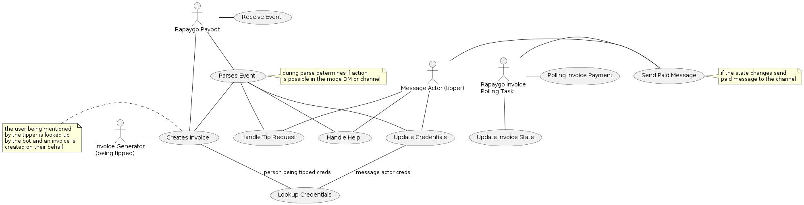

# rapaygo-discord-bot
Lightning Payment Discord Bot

## MVP

* creates invoices to pay the person mentioned on tip commands (target must have set credentials)
* allows DM to set credentials
* can protect access to the guild channels by requesting payment

# building and running

## using pyenv
1. create virtualenv from pyenv - `pyenv virtualenv 3.8.2 rapaygo-discord-bot`
2. start ypur venv shell - `pyenv shell rapaygo-discord-bot`
3. install latest pip - `pip install --upgrade pip`
4. install requirements - `pip install -r requirements.txt`

# running the bot

